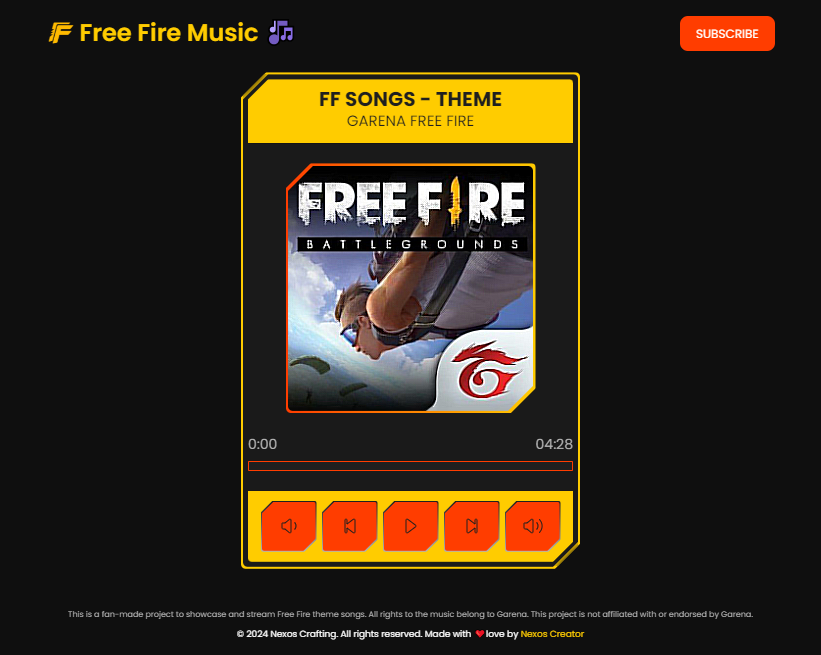
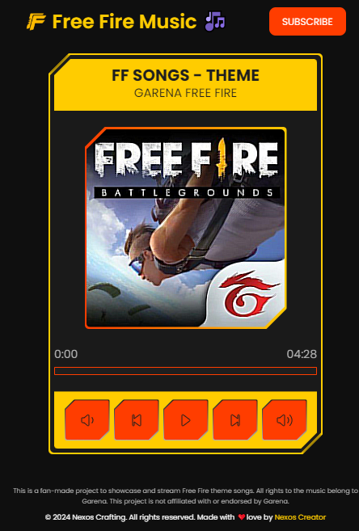

[](https://nexoscrafting.github.io/free-fire-music/)

[](#-contributors)
[](https://github.com/nexoscrafting/free-fire-music/stargazers)

# 🎶 Free Fire Music - Stream Theme Songs 🎮

> A fan-made website dedicated to Free Fire 🎮 theme songs, featuring a sleek UI, music player, and more. Not affiliated with Garena.



---

## 🌟 Features

- 🎵 **Stream Free Fire theme songs** in a user-friendly interface.
- 💻 **Responsive Design** for mobile and desktop.
- 🎨 **Sleek and Modern UI** built with Next.js and Tailwind CSS.
- 🎧 **Audio Player** powered by Nexos Creation Player.
- 🌐 Hosted on GitHub Pages for easy access.

---

### Links

[](https://nexoscrafting.github.io/free-fire-music)
[](https://github.com/nexoscrafting/free-fire-music)
<!-- [](https://youtu.be/rMnDe0iEGRs?si=B2viVesOhHYusbBG) -->

---

## 📸 Screenshots of Music Player 🎧



## 📜 License

This project is licensed under the MIT License. See the [LICENSE](LICENSE) file for details.

---

> This is a fan project and is not affiliated with or endorsed by Garena. All rights to Free Fire and its assets belong to Garena.

```
Thank you for visiting don't forgot to subscribe our channel
```
